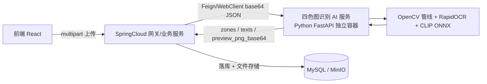

# 四色分布图识别微服务抽取 — 设计规格

日期：2026-08-07
状态：头脑风暴已批准（方案 A），等待用户审查书面规格

## 1. 背景与目标

现有系统的四色分布图识别（OpenCV 颜色分割 + RapidOCR + CLIP 视觉辅助）效果良好，公司内其他系统也需要同样的能力。用户希望把识别模块独立出来，封装成微服务部署在公司内部，供公司内系统通过 SpringCloud 调用。

目标：

1. 识别模块抽取为**无状态独立 Web 服务**（保留 Python 实现，模型不进 Java）。
2. 现有 SpringCloud 架构通过 Feign/WebClient 调用该服务，具备超时、重试、熔断能力，前端异步调用不阻塞 Spring。
3. 给出独立服务的接口文档（接收/返回参数），前端与 Java 调用方按同一契约对接。
4. 现有业务系统前端**零改动**（接口契约由 Java 侧透传保持稳定）。

范围：仅抽取"四色分布图识别"为独立服务；不改识别算法本身、不改前端交互、不做 Java 重写。

## 2. 需求决策（头脑风暴结论）

1. **方案选型：方案 A（推荐）**——识别模块保留 Python，部署为独立 FastAPI 服务；Java SpringCloud 通过 HTTP 调用。方案 B（Java 重写，JavaCV + onnxruntime-java）技术上可行但属于重写而非移植：算法阈值调参、OCR/CLIP 预处理与 embedding 加载、现有识别测试全部要重新对齐，且长期维护两套相同逻辑。仅在"公司禁止 Python 运行时"的硬约束下才选 B。
2. **服务边界：AI 服务无状态**。只做"图片进 → 识别结果出"；不落库、不存文件、不做业务鉴权、不涉及楼层/企业归属校验。
3. **传输格式：JSON + base64**。请求传 `image_base64`，响应带 `preview_png_base64`；避免 Feign 上传文件需引入 feign-form 的坑。内网多约 33% 体积可接受。若后续出现公网/大图场景，再评估 multipart。
4. **鉴权：`X-API-Key` 请求头**。仅限公司内网，不暴露公网。
5. **可靠性：Java 侧 Resilience4j**（Hystrix 已进入维护模式）——超时、重试（仅幂等 analyze）、熔断（仅 5xx/超时）。
6. **异步：CompletableFuture + 专用线程池**为主，WebClient 响应式为备选；请求线程内禁止 `.block()`。
7. **不做 202 + 任务轮询模式**：当前识别链路秒级，同步 + 超时熔断足够（YAGNI）。

## 3. 现状盘点与抽取边界

### 3.1 识别模块资产（全部搬入独立服务）

| 资产 | 路径 | 说明 |
|---|---|---|
| 识别管线 | `backend/app/services/four_color_recognizer.py` | OpenCV 颜色分割/形态学/轮廓/透视校正/干扰过滤，约 400 行纯函数 |
| 视觉辅助 | `backend/app/services/vision_helpers.py` | RapidOCR 文字提取 + CLIP 疑似判别，延迟加载、缺失自动降级 |
| CLIP 模型 | `backend/models/clip_vision.onnx`（351MB fp32）+ `clip_prompts.npz` | 构建期打包进镜像 |
| OCR 模型 | rapidocr_onnxruntime 依赖自带 | 随 Python 包安装 |
| 依赖 | opencv-python-headless / numpy / Pillow / rapidocr_onnxruntime / onnxruntime | requirements.txt 锁定版本 |

### 3.2 留在 Java 侧（不抽取）

- 文件存储：`save_four_color_temp` / `promote_four_color_file` / `remove_four_color_temp_dir`（当前路由的临时预览文件逻辑 → 由 Java 侧新建 `PreviewStorageService` 承接：收到 `preview_png_base64` 后存盘并返回 URL；实现为「接口 + 本地磁盘实现」，后续可平滑切换 MinIO）。
- DB 落库：`POST .../four-color/commit` 路由（分区创建、replace_existing 事务、多边形校验 `validate_polygon_v2`）。
- 业务鉴权：`get_current_user`、企业/楼层归属校验（`_get_ent` + floor 校验）。
- 前端接口层：现有 analyze/commit/cancel 路由契约保持不变。

### 3.3 抽取边界结论

AI 服务是纯无状态推理，不依赖本项目 DB、上传目录、用户体系；识别代码与模型零改动即可独立运行。这是本次抽取风险最低的部分；真正的新代码在 Java 侧（Feign 调用 + 存储转换 + 熔断配置）。

## 4. 目标架构



部署建议：Docker 独立容器（镜像含 `backend/models/` CLIP 资产 + RapidOCR），CPU 2-4 核 / 内存 4GB 起步（ONNX Runtime 常驻约 1.5-2GB）；当前识别链路秒级，单副本足够，Java 侧熔断兜底后可独立扩缩容。

## 5. AI 服务接口契约（独立服务）

### 5.1 POST `/api/v1/four-color/analyze`

请求头：

| 头 | 必填 | 说明 |
|---|---|---|
| `X-API-Key` | 是 | 内部密钥，服务启动时通过环境变量配置 |
| `Content-Type` | 是 | `application/json` |

请求体：

```json
{
  "image_base64": "<原始图片 base64>",
  "options": {
    "max_zones": 200,
    "canvas_width": 1600,
    "canvas_height": 1000,
    "enable_ocr": true,
    "enable_clip": true
  }
}
```

| 参数 | 类型 | 必填 | 默认 | 说明 |
|---|---|---|---|---|
| image_base64 | string | 是 | — | PNG/JPG/JPEG/BMP/WebP 的 base64 |
| options.max_zones | int | 否 | 200 | 最多保留分区数 |
| options.canvas_width | int | 否 | 1600 | 预览画布宽（等比缩放） |
| options.canvas_height | int | 否 | 1000 | 预览画布高（等比缩放） |
| options.enable_ocr | bool | 否 | true | 是否启用 RapidOCR 建议名 |
| options.enable_clip | bool | 否 | true | 是否启用 CLIP 疑似判别 |

响应 `200`：

```json
{
  "code": 0,
  "message": "ok",
  "data": {
    "request_id": "uuid",
    "width": 1333,
    "height": 1000,
    "canvas_width": 1333,
    "canvas_height": 1000,
    "preview_png_base64": "<处理后预览图 PNG base64>",
    "zones": [
      {
        "client_id": "draft-xxx",
        "name": "分区1",
        "risk_level": "重大",
        "color": "#ff4d4f",
        "suspected": false,
        "suggested_name": "配电室",
        "ai_hint": null,
        "polygons": [
          { "id": "poly-xxx", "label": null, "points": [ { "x": 12.34, "y": 56.78 } ] }
        ]
      }
    ],
    "texts": [
      { "points": [ { "x": 1.2, "y": 3.4 } ], "text": "配电室", "confidence": 0.91 }
    ],
    "excluded": [
      { "color": "蓝", "reason": "thin", "polygons": [] }
    ],
    "warnings": ["识别区域过多，已保留前 200 个"]
  }
}
```

字段说明：

| 字段 | 说明 |
|---|---|
| data.width / height | 处理后原图尺寸（像素） |
| data.canvas_width / height | 预览画布尺寸，即 Java 侧落库的 canvas 尺寸 |
| data.preview_png_base64 | 处理后预览图 PNG base64，Java 侧存盘转 URL |
| zones[].risk_level | `重大/较大/一般/低`，对应红/橙/黄/蓝 |
| zones[].suspected | 疑似干扰但保留，前端加"疑似"标签 |
| zones[].suggested_name | OCR 命中的分区建议名，可为 null |
| zones[].ai_hint | CLIP 提示（仅提示不自动删除），可为 null |
| polygons[].points | **0-100 归一化坐标**（2 位小数、越界 clamp），消费方不要再除画布宽高 |
| excluded[].reason | `tiny / thin / border_frame / legend` |
| texts[].points | 同归一化坐标（4 点文本框） |

错误码：

| HTTP | code | 含义 | Java 侧处理 |
|---|---|---|---|
| 400 | INVALID_IMAGE | 图片解码失败 | 不重试、不熔断 |
| 422 | NO_ZONE_DETECTED | 未识别到红/橙/黄/蓝色块 | 不重试、不熔断 |
| 500 | INTERNAL | 识别管线异常 | 重试 + 计入熔断 |
| 503 | MODEL_UNAVAILABLE | OCR/CLIP 模型未加载 | 重试 + 计入熔断 |

幂等性：analyze 为纯计算，幂等，可安全重试。

### 5.2 独立服务骨架（Python）

```python
# app/main.py（独立工程）
from fastapi import Depends, FastAPI, Header, HTTPException
from pydantic import BaseModel, Field
from uuid import uuid4

from app.services.four_color_recognizer import recognize_from_bytes, build_output_image


class Options(BaseModel):
    max_zones: int = 200
    canvas_width: int = 1600
    canvas_height: int = 1000
    enable_ocr: bool = True
    enable_clip: bool = True


class AnalyzeRequest(BaseModel):
    image_base64: str
    options: Options = Field(default_factory=Options)


app = FastAPI(title="four-color-ai", version="1.0.0")


def require_api_key(x_api_key: str = Header(..., alias="X-API-Key")):
    import os
    if x_api_key != os.environ.get("FOUR_COLOR_API_KEY", ""):
        raise HTTPException(401, "invalid api key")


@app.post("/api/v1/four-color/analyze")
async def analyze(body: AnalyzeRequest, _: None = Depends(require_api_key)):
    import base64
    try:
        raw = base64.b64decode(body.image_base64)
    except Exception:
        raise HTTPException(400, detail={"code": "INVALID_IMAGE", "message": "图片 base64 解码失败"})
    try:
        result = recognize_from_bytes(raw)
    except RuntimeError:
        raise HTTPException(503, detail={"code": "MODEL_UNAVAILABLE", "message": "识别模型未加载"})
    except Exception:
        raise HTTPException(500, detail={"code": "INTERNAL", "message": "识别管线异常"})
    if not result.zones:
        raise HTTPException(422, detail={"code": "NO_ZONE_DETECTED",
                                        "message": "未识别到红/橙/黄/蓝色块"})
    png_bytes, cw, ch = build_output_image(result.processed_image, result.width, result.height)
    return {
        "code": 0, "message": "ok",
        "data": {
            "request_id": uuid4().hex,
            "width": result.width, "height": result.height,
            "canvas_width": cw, "canvas_height": ch,
            "preview_png_base64": base64.b64encode(png_bytes).decode(),
            "zones": result.zones, "texts": result.texts,
            "excluded": result.excluded, "warnings": result.warnings,
        },
    }
```

注：`recognize_from_bytes` / `vision_helpers` / `models` 原样搬运，仅调整 import 路径；`FOUR_COLOR_MODELS_DIR` 环境变量指向镜像内模型目录。

另注：`options` 字段为契约预留——当前识别器阈值为常量（`MAX_ZONES` 等），实现首版可不透传（默认值生效），后续需要时再接入，不阻塞接口契约。

## 6. Java 调用方设计

### 6.1 依赖

```groovy
implementation 'org.springframework.cloud:spring-cloud-starter-openfeign'
implementation 'org.springframework.cloud:spring-cloud-starter-circuitbreaker-resilience4j'
// 如用 WebClient 响应式方案
implementation 'org.springframework.boot:spring-boot-starter-webflux'
```

### 6.2 DTO 与 Feign Client

```java
// dto/FourColorAnalyzeRequest.java
public record FourColorAnalyzeRequest(String imageBase64, Options options) {
    public record Options(int maxZones, int canvasWidth, int canvasHeight,
                          boolean enableOcr, boolean enableClip) {
        public static Options defaults() {
            return new Options(200, 1600, 1000, true, true);
        }
    }
}

// dto/FourColorAnalyzeResult.java —— 与 5.1 data 字段一一对应
public record FourColorAnalyzeResult(
        String requestId,
        int width, int height,
        int canvasWidth, int canvasHeight,
        String previewPngBase64,
        List<Zone> zones,
        List<TextItem> texts,
        List<ExcludedItem> excluded,
        List<String> warnings) {

    public record Point(double x, double y) {}
    public record Polygon(String id, String label, List<Point> points) {}
    public record Zone(String clientId, String name, String riskLevel, String color,
                       boolean suspected, String suggestedName, String aiHint,
                       List<Polygon> polygons) {}
    public record TextItem(List<Point> points, String text, double confidence) {}
    public record ExcludedItem(String color, String reason, List<Polygon> polygons) {}
}

// dto/AiResponse.java
public record AiResponse<T>(int code, String message, T data) {
    public boolean ok() { return code == 0; }
}

// client/FourColorAiClient.java
@FeignClient(
        name = "four-color-ai",
        url = "${ai-service.four-color.base-url}",
        configuration = FourColorAiFeignConfig.class
)
public interface FourColorAiClient {

    @PostMapping(value = "/api/v1/four-color/analyze",
                 consumes = MediaType.APPLICATION_JSON_VALUE)
    AiResponse<FourColorAnalyzeResult> analyze(@RequestBody FourColorAnalyzeRequest request);
}
```

Feign 配置：连接超时 3s、读超时 30s；ErrorDecoder 区分业务错误（422 → `FourColorParseException`，不重试不熔断）与基础设施错误（5xx → `FourColorAiUnavailableException`，触发重试/熔断）。

### 6.3 Resilience4j 配置

```yaml
spring:
  cloud:
    openfeign:
      client:
        config:
          four-color-ai:
            connectTimeout: 3000
            readTimeout: 30000

resilience4j:
  timelimiter:
    instances:
      fourColorAi:
        timeoutDuration: 35s
        cancelRunningFuture: true
  circuitbreaker:
    instances:
      fourColorAi:
        slidingWindowSize: 10
        failureRateThreshold: 50
        waitDurationInOpenState: 15s
        permittedNumberOfCallsInHalfOpenState: 3
        slidingWindowType: COUNT_BASED
        recordExceptions:
          - com.example.FourColorAiUnavailableException
          - feign.FeignException$ServiceUnavailable
  retry:
    instances:
      fourColorAi:
        maxAttempts: 3
        waitDuration: 1s
        retryExceptions:
          - com.example.FourColorAiUnavailableException
          - java.net.SocketTimeoutException
        ignoreExceptions:
          - com.example.FourColorParseException
          - feign.FeignException$BadRequest
```

Facade 层注解组合（Resilience4j 默认执行顺序：Retry → CircuitBreaker → TimeLimiter）：

```java
@Service
public class FourColorAiFacade {

    private final FourColorAiClient client;

    @Retry(name = "fourColorAi", fallbackMethod = "analyzeFallback")
    @CircuitBreaker(name = "fourColorAi")
    public FourColorAnalyzeResult analyze(String imageBase64) {
        AiResponse<FourColorAnalyzeResult> resp = client.analyze(
                new FourColorAnalyzeRequest(imageBase64, FourColorAnalyzeRequest.Options.defaults()));
        if (!resp.ok()) {
            throw new FourColorAiException("AI 服务业务失败: code=" + resp.code());
        }
        return resp.data();
    }

    private FourColorAnalyzeResult analyzeFallback(String imageBase64, Throwable t) {
        throw new FourColorAiUnavailableException("四色图识别服务暂不可用", t);
    }
}
```

注意点：

1. **重试只适用于幂等 analyze**；commit 类落库操作留在 Java 侧，不经 AI 服务，天然无重试风险。
2. 同步 Feign 调用超时由 `readTimeout` 兜底；`TimeLimiter` 仅在异步/`CompletableFuture` 场景生效。
3. 熔断打开后请求直接走 fallback 快速失败，不干等 AI 服务。

### 6.4 异步调用（前端不阻塞）

主方案：`@Async` + `CompletableFuture` + 专用线程池（Tomcat worker 立即释放）：

```java
@Configuration
@EnableAsync
public class AsyncConfig {
    @Bean("aiCallExecutor")
    public Executor aiCallExecutor() {
        ThreadPoolTaskExecutor e = new ThreadPoolTaskExecutor();
        e.setCorePoolSize(4);
        e.setMaxPoolSize(8);
        e.setQueueCapacity(50);
        e.setThreadNamePrefix("ai-call-");
        e.initialize();
        return e;
    }
}

@Service
public class FourColorAiAsyncService {

    private final FourColorAiFacade facade;

    @Async("aiCallExecutor")
    public CompletableFuture<FourColorAnalyzeResult> analyzeAsync(String imageBase64) {
        return CompletableFuture.completedFuture(facade.analyze(imageBase64));
    }
}
```

备选：WebClient + `Mono`（timeout 35s + `Retry.backoff(2)`，仅对 5xx/超时重试），控制器返回 `CompletableFuture` 或全链路 WebFlux 后直接返回 `Mono`。铁律：请求线程内禁止 `.block()`。

### 6.5 前端兼容

现有前端接口（`POST /api/v1/enterprises/{eid}/risk-management/floors/{fid}/four-color/analyze`，multipart，响应含 `preview_url / canvas_width / canvas_height / zones / warnings / excluded / texts`）**保持不变**。Java 控制器收到 AI 结果后，仅把 `preview_png_base64` 交给 `PreviewStorageService` 存为文件并返回 URL，其余字段透传；前端零改动。

## 7. 实施清单（抽取任务分解）

1. **独立 Python 服务工程**：FastAPI `main.py`（analyze 路由 + `X-API-Key` + base64 编解码，见 5.2）；搬运 `four_color_recognizer.py`、`vision_helpers.py`、`backend/models/` 资产；锁定依赖版本；Dockerfile 构建期打包模型。
2. **识别测试移植**：现有识别器单测原样搬入；新增服务级测试（正常识别、无色块 422、非法图片 400、缺模型降级、base64 编解码往返）。
3. **Java 侧接入**：DTO + Feign Client + ErrorDecoder + Resilience4j 配置 + Facade/Async 服务 + Controller。
4. **Java 侧存储转换**：`PreviewStorageService`（base64 → 本地磁盘 → URL，后续可切 MinIO），替换原 `save_four_color_temp` 的职责。
5. **联调与验证**：真实 AI 服务端到端 analyze 200；坐标 0-100 无越界；前端原流程可用。
6. **部署与可靠性验证**：Docker 部署 AI 服务；验证 Java 侧超时（AI 停服 → 30s 内报错）、熔断（连续失败 → 快速失败）、恢复（服务恢复 → 半开 → 关闭）。

验收标准：

- 独立服务通过现有识别测试 + 服务级测试（pytest 全绿）。
- Java 端 analyze 全链路 200，前端接口契约不变。
- AI 服务停服时 Java 端 30s 内超时降级；恢复后自动恢复调用。
- 抽取后原系统回归：四色导入 analyze/commit/cancel 三个接口行为不变。

## 8. 风险与应对

| 风险 | 应对 |
|---|---|
| CLIP 资产 351MB，镜像体积大 | 构建期打包进独立层；资产缺失自动降级（现有 `load_clip` 机制），识别主体不阻塞 |
| base64 体积膨胀约 33% | 内网可接受；若未来公网/大图，改为 multipart 上传 + URL 返回 |
| 熔断误伤业务 | 仅 5xx/超时计入熔断，422/400 业务错误不重试不熔断 |
| Python 环境漂移 | requirements 锁定版本，Docker 固定基础镜像 |
| 双端契约漂移 | AI 服务提供 OpenAPI 文档；Java DTO 以 5.1 契约为准，接口变更走评审 |

## 9. 非目标（范围外）

- 不做 Java 重写（方案 B 仅作为备选记录）。
- 不做 202 + 任务轮询异步模式。
- 不做多租户/完整 SSO（内网 `X-API-Key` 足够）。
- 不改识别算法、阈值与干扰过滤规则。
